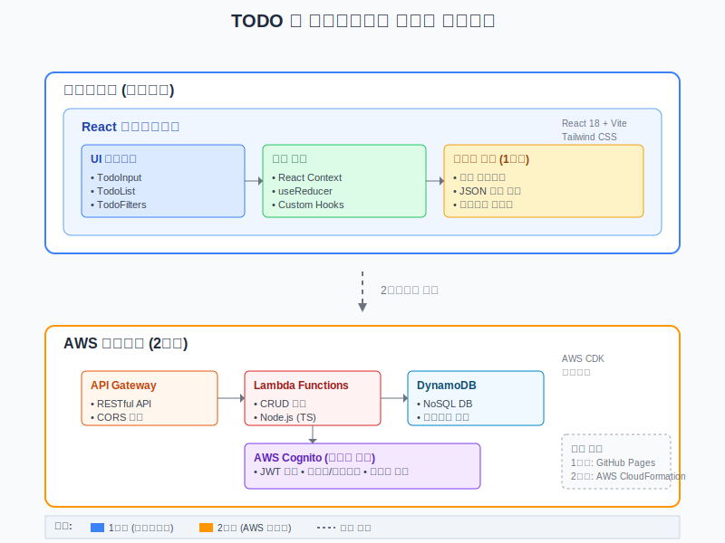
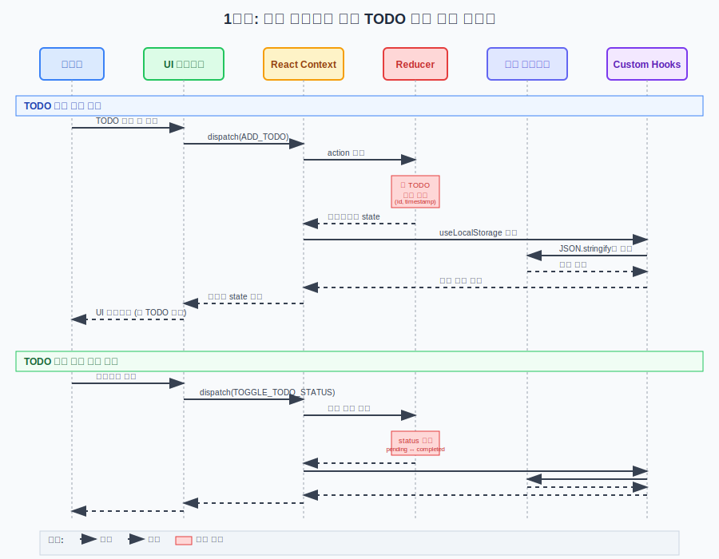
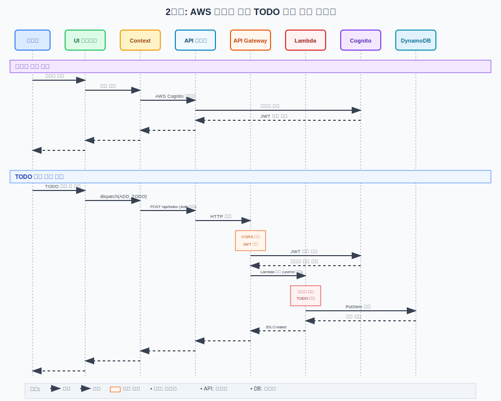

# TODO 웹 애플리케이션 설계 문서

## 1. 개요

이 문서는 TODO 웹 애플리케이션의 상세한 설계 사항을 정의합니다. 요구사항 문서를 기반으로 시스템 아키텍처, 컴포넌트 구조, 데이터 모델, UI/UX 설계 등을 포함합니다.

## 2. 시스템 아키텍처

### 2.1 전체 아키텍처 개요

#### 상세 아키텍처 다이어그램



#### 아키텍처 구성 요소

**1단계: 프론트엔드 전용**
- **클라이언트 계층**: React 18 + Vite + Tailwind CSS
- **상태 관리**: React Context + useReducer 패턴
- **데이터 저장**: 브라우저 로컬 스토리지
- **배포**: GitHub Pages + GitHub Actions

**2단계: AWS 서버리스 백엔드**
- **API 계층**: AWS API Gateway (RESTful API)
- **비즈니스 로직**: AWS Lambda Functions (Node.js TypeScript)
- **데이터 계층**: Amazon DynamoDB (NoSQL)
- **인증**: AWS Cognito (JWT 기반)
- **인프라**: AWS CDK로 관리

### 2.2 개발 단계별 아키텍처

#### 1단계: 프론트엔드 전용 (로컬 스토리지)
- **클라이언트**: React + Tailwind CSS + Vite
- **상태 관리**: React Context + useReducer
- **데이터 저장**: 브라우저 로컬 스토리지
- **배포**: GitHub Pages

#### 2단계: 백엔드 연동 (AWS 서버리스)
- **API**: AWS API Gateway + Lambda Functions
- **데이터베이스**: AWS DynamoDB
- **인증**: AWS Cognito
- **인프라**: AWS CDK로 관리
- **배포**: AWS CloudFormation

### 2.3 요청 처리 시퀀스 다이어그램

#### 1단계: 로컬 스토리지 기반 요청 처리



**주요 처리 흐름:**
1. **사용자 입력**: 사용자가 UI에서 TODO를 입력하고 제출
2. **액션 디스패치**: UI 컴포넌트에서 React Context로 ADD_TODO 액션 전달
3. **상태 업데이트**: Reducer에서 새로운 TODO 객체 생성 (ID, 타임스탬프 포함)
4. **로컬 저장**: Custom Hooks를 통해 로컬 스토리지에 JSON 형태로 저장
5. **UI 반영**: 업데이트된 상태가 UI에 반영되어 새 TODO 표시

**특징:**
- 동기적 처리로 빠른 응답 시간
- 네트워크 의존성 없음
- 브라우저 간 데이터 공유 불가
- 오프라인 환경에서도 동작

#### 2단계: AWS 백엔드 기반 요청 처리



**주요 처리 흐름:**
1. **인증 단계**: 사용자 로그인 → Cognito 인증 → JWT 토큰 발급
2. **요청 전송**: API 서비스에서 Authorization 헤더와 함께 HTTP 요청
3. **API Gateway 처리**: CORS 검증 및 JWT 토큰 검증
4. **Lambda 실행**: 비즈니스 로직 처리 및 데이터 검증
5. **데이터 저장**: DynamoDB에 사용자별로 분리된 데이터 저장
6. **응답 반환**: 성공 응답과 함께 생성된 TODO 데이터 반환

**에러 처리 시나리오:**
- **JWT 토큰 만료**: 401 Unauthorized → 자동 로그인 페이지 리다이렉트
- **DynamoDB 에러**: 500 Internal Error → 사용자에게 서버 오류 알림
- **네트워크 에러**: Timeout/Connection Error → 재시도 옵션 제공

**특징:**
- 확장 가능한 서버리스 아키텍처
- 사용자별 데이터 격리 및 보안
- 실시간 데이터 동기화 가능
- 다중 디바이스 간 데이터 공유

## 3. 데이터 모델 설계

### 3.1 TODO 항목 데이터 구조

```typescript
interface TodoItem {
  id: string;                    // 고유 식별자 (UUID)
  title: string;                 // 제목 (필수)
  priority: 'low' | 'medium' | 'high';  // 우선순위
  status: 'pending' | 'completed';      // 상태
  createdAt: string;             // 생성 시간 (ISO 8601)
  updatedAt: string;             // 수정 시간 (ISO 8601)
  userId?: string;               // 사용자 ID (2단계에서 추가)
}
```

### 3.2 애플리케이션 상태 구조

```typescript
interface AppState {
  todos: TodoItem[];
  filter: 'all' | 'pending' | 'completed';
  sortBy: 'createdAt' | 'priority' | 'title';
  sortOrder: 'asc' | 'desc';
  searchQuery: string;
  theme: 'light' | 'dark';
  isLoading: boolean;
  error: string | null;
}
```

### 3.3 DynamoDB 테이블 설계 (2단계)

**테이블명**: `TodoItems`

| 속성명 | 타입 | 키 | 설명 |
|--------|------|-----|------|
| userId | String | PK | 사용자 ID (Cognito Sub) |
| todoId | String | SK | TODO 항목 ID |
| title | String | - | TODO 제목 |
| priority | String | - | 우선순위 (low/medium/high) |
| status | String | - | 상태 (pending/completed) |
| createdAt | String | - | 생성 시간 |
| updatedAt | String | - | 수정 시간 |

**GSI (Global Secondary Index)**:
- `status-createdAt-index`: 상태별 정렬을 위한 인덱스

## 4. 컴포넌트 아키텍처

### 4.1 컴포넌트 계층 구조

```
App
├── Header
│   ├── Logo
│   ├── ThemeToggle
│   └── UserProfile (2단계)
├── TodoContainer
│   ├── TodoInput
│   ├── TodoFilters
│   │   ├── StatusFilter
│   │   ├── PrioritySort
│   │   └── SearchInput
│   └── TodoList
│       └── TodoItem
│           ├── TodoContent
│           ├── PriorityBadge
│           ├── StatusToggle
│           └── ActionButtons
└── Footer
```

### 4.2 주요 컴포넌트 설계

#### 4.2.1 App 컴포넌트
```typescript
// App.tsx
interface AppProps {}

const App: React.FC<AppProps> = () => {
  // Context Provider로 전역 상태 관리
  // 테마 설정 관리
  // 라우팅 설정 (필요시)
}
```

#### 4.2.2 TodoInput 컴포넌트
```typescript
// components/TodoInput.tsx
interface TodoInputProps {
  onAddTodo: (title: string, priority: Priority) => void;
}

const TodoInput: React.FC<TodoInputProps> = ({ onAddTodo }) => {
  // 새 TODO 입력 폼
  // 우선순위 선택 드롭다운
  // 입력 검증 및 제출 처리
}
```

#### 4.2.3 TodoItem 컴포넌트
```typescript
// components/TodoItem.tsx
interface TodoItemProps {
  todo: TodoItem;
  onToggleStatus: (id: string) => void;
  onUpdateTodo: (id: string, updates: Partial<TodoItem>) => void;
  onDeleteTodo: (id: string) => void;
}

const TodoItem: React.FC<TodoItemProps> = ({ 
  todo, 
  onToggleStatus, 
  onUpdateTodo, 
  onDeleteTodo 
}) => {
  // TODO 항목 표시
  // 인라인 편집 기능
  // 상태 토글 버튼
  // 삭제 버튼
}
```

### 4.3 상태 관리 설계

#### 4.3.1 Context 구조
```typescript
// contexts/TodoContext.tsx
interface TodoContextType {
  state: AppState;
  dispatch: React.Dispatch<TodoAction>;
  actions: {
    addTodo: (title: string, priority: Priority) => void;
    updateTodo: (id: string, updates: Partial<TodoItem>) => void;
    deleteTodo: (id: string) => void;
    toggleTodoStatus: (id: string) => void;
    setFilter: (filter: FilterType) => void;
    setSortBy: (sortBy: SortType) => void;
    setSearchQuery: (query: string) => void;
    setTheme: (theme: Theme) => void;
  };
}
```

#### 4.3.2 Reducer 액션 타입
```typescript
// types/actions.ts
type TodoAction =
  | { type: 'ADD_TODO'; payload: { title: string; priority: Priority } }
  | { type: 'UPDATE_TODO'; payload: { id: string; updates: Partial<TodoItem> } }
  | { type: 'DELETE_TODO'; payload: { id: string } }
  | { type: 'TOGGLE_TODO_STATUS'; payload: { id: string } }
  | { type: 'SET_FILTER'; payload: { filter: FilterType } }
  | { type: 'SET_SORT'; payload: { sortBy: SortType; sortOrder: SortOrder } }
  | { type: 'SET_SEARCH_QUERY'; payload: { query: string } }
  | { type: 'SET_THEME'; payload: { theme: Theme } }
  | { type: 'SET_LOADING'; payload: { isLoading: boolean } }
  | { type: 'SET_ERROR'; payload: { error: string | null } };
```

## 5. UI/UX 설계

### 5.1 디자인 시스템

#### 5.1.1 색상 팔레트
```css
/* 라이트 모드 */
:root {
  --color-primary: #3b82f6;      /* Blue-500 */
  --color-primary-hover: #2563eb; /* Blue-600 */
  --color-success: #10b981;       /* Emerald-500 */
  --color-warning: #f59e0b;       /* Amber-500 */
  --color-danger: #ef4444;        /* Red-500 */
  --color-background: #ffffff;    /* White */
  --color-surface: #f8fafc;       /* Slate-50 */
  --color-text-primary: #1e293b;  /* Slate-800 */
  --color-text-secondary: #64748b; /* Slate-500 */
  --color-border: #e2e8f0;        /* Slate-200 */
}

/* 다크 모드 */
[data-theme="dark"] {
  --color-primary: #60a5fa;       /* Blue-400 */
  --color-primary-hover: #3b82f6; /* Blue-500 */
  --color-success: #34d399;       /* Emerald-400 */
  --color-warning: #fbbf24;       /* Amber-400 */
  --color-danger: #f87171;        /* Red-400 */
  --color-background: #0f172a;    /* Slate-900 */
  --color-surface: #1e293b;       /* Slate-800 */
  --color-text-primary: #f1f5f9;  /* Slate-100 */
  --color-text-secondary: #94a3b8; /* Slate-400 */
  --color-border: #334155;        /* Slate-700 */
}
```

#### 5.1.2 타이포그래피
```css
/* 폰트 크기 및 가중치 */
.text-xs { font-size: 0.75rem; }    /* 12px */
.text-sm { font-size: 0.875rem; }   /* 14px */
.text-base { font-size: 1rem; }     /* 16px */
.text-lg { font-size: 1.125rem; }   /* 18px */
.text-xl { font-size: 1.25rem; }    /* 20px */
.text-2xl { font-size: 1.5rem; }    /* 24px */

.font-normal { font-weight: 400; }
.font-medium { font-weight: 500; }
.font-semibold { font-weight: 600; }
.font-bold { font-weight: 700; }
```

#### 5.1.3 우선순위 색상 매핑
```typescript
const priorityColors = {
  low: {
    bg: 'bg-gray-100 dark:bg-gray-800',
    text: 'text-gray-600 dark:text-gray-400',
    border: 'border-gray-300 dark:border-gray-600'
  },
  medium: {
    bg: 'bg-yellow-100 dark:bg-yellow-900/20',
    text: 'text-yellow-600 dark:text-yellow-400',
    border: 'border-yellow-300 dark:border-yellow-600'
  },
  high: {
    bg: 'bg-red-100 dark:bg-red-900/20',
    text: 'text-red-600 dark:text-red-400',
    border: 'border-red-300 dark:border-red-600'
  }
};
```

### 5.2 반응형 디자인

#### 5.2.1 브레이크포인트
```css
/* Tailwind CSS 기본 브레이크포인트 사용 */
/* sm: 640px */
/* md: 768px */
/* lg: 1024px */
/* xl: 1280px */
/* 2xl: 1536px */
```

#### 5.2.2 모바일 우선 레이아웃
```typescript
// 모바일 (기본)
const mobileLayout = {
  container: 'px-4 py-6',
  todoItem: 'p-4 mb-3',
  input: 'text-base p-3',
  button: 'px-4 py-2 text-sm'
};

// 태블릿 (md 이상)
const tabletLayout = {
  container: 'px-6 py-8 max-w-2xl mx-auto',
  todoItem: 'p-5 mb-4',
  input: 'text-base p-4',
  button: 'px-6 py-3 text-base'
};

// 데스크톱 (lg 이상)
const desktopLayout = {
  container: 'px-8 py-10 max-w-4xl mx-auto',
  todoItem: 'p-6 mb-4',
  input: 'text-lg p-4',
  button: 'px-8 py-3 text-base'
};
```

### 5.3 접근성 설계

#### 5.3.1 키보드 네비게이션
- Tab 키로 모든 인터랙티브 요소 접근 가능
- Enter 키로 버튼 활성화
- Escape 키로 모달/편집 모드 취소
- 화살표 키로 목록 네비게이션

#### 5.3.2 스크린 리더 지원
```typescript
// ARIA 레이블 및 속성
const accessibilityProps = {
  todoItem: {
    role: 'listitem',
    'aria-label': `TODO: ${title}, Priority: ${priority}, Status: ${status}`
  },
  statusToggle: {
    'aria-label': `Mark as ${status === 'completed' ? 'pending' : 'completed'}`,
    'aria-pressed': status === 'completed'
  },
  deleteButton: {
    'aria-label': `Delete TODO: ${title}`
  }
};
```

## 6. API 설계 (2단계)

### 6.1 RESTful API 엔드포인트

```
GET    /api/todos              # TODO 목록 조회
POST   /api/todos              # 새 TODO 생성
GET    /api/todos/{id}         # 특정 TODO 조회
PUT    /api/todos/{id}         # TODO 수정
DELETE /api/todos/{id}         # TODO 삭제
PATCH  /api/todos/{id}/status  # TODO 상태 토글
```

### 6.2 Lambda 함수 구조

```typescript
// lambda/todos/handler.ts
export const handler = async (event: APIGatewayProxyEvent): Promise<APIGatewayProxyResult> => {
  const { httpMethod, pathParameters, body } = event;
  const userId = event.requestContext.authorizer?.claims?.sub;

  switch (httpMethod) {
    case 'GET':
      return pathParameters?.id 
        ? await getTodoById(userId, pathParameters.id)
        : await getTodos(userId);
    case 'POST':
      return await createTodo(userId, JSON.parse(body || '{}'));
    case 'PUT':
      return await updateTodo(userId, pathParameters?.id, JSON.parse(body || '{}'));
    case 'DELETE':
      return await deleteTodo(userId, pathParameters?.id);
    case 'PATCH':
      return await toggleTodoStatus(userId, pathParameters?.id);
    default:
      return { statusCode: 405, body: JSON.stringify({ error: 'Method not allowed' }) };
  }
};
```

## 7. 보안 설계

### 7.1 클라이언트 사이드 보안
- XSS 방지: React의 기본 이스케이핑 활용
- 입력 검증: 클라이언트와 서버 양쪽에서 검증
- HTTPS 강제 사용

### 7.2 서버 사이드 보안 (2단계)
- AWS Cognito를 통한 인증/인가
- JWT 토큰 검증
- API Gateway에서 CORS 설정
- DynamoDB 접근 권한 최소화

## 8. 성능 최적화

### 8.1 프론트엔드 최적화
- React.memo를 통한 불필요한 리렌더링 방지
- useMemo, useCallback을 통한 연산 최적화
- 가상화를 통한 대량 데이터 처리 (필요시)
- 코드 스플리팅을 통한 번들 크기 최적화

### 8.2 백엔드 최적화 (2단계)
- DynamoDB 쿼리 최적화
- Lambda 콜드 스타트 최소화
- CloudFront를 통한 CDN 활용

## 9. 테스트 전략

### 9.1 단위 테스트
```typescript
// __tests__/components/TodoItem.test.tsx
describe('TodoItem', () => {
  it('should render todo item correctly', () => {
    // 컴포넌트 렌더링 테스트
  });

  it('should toggle status when clicked', () => {
    // 상태 토글 기능 테스트
  });

  it('should call onDelete when delete button is clicked', () => {
    // 삭제 기능 테스트
  });
});
```

### 9.2 통합 테스트
```typescript
// __tests__/integration/TodoApp.test.tsx
describe('Todo App Integration', () => {
  it('should add, edit, and delete todos', () => {
    // 전체 워크플로우 테스트
  });
});
```

### 9.3 E2E 테스트 (선택사항)
- Playwright 또는 Cypress를 사용한 브라우저 테스트
- 주요 사용자 시나리오 테스트

## 10. 배포 전략

### 10.1 1단계 배포 (GitHub Pages)
```yaml
# .github/workflows/deploy.yml
name: Deploy to GitHub Pages
on:
  push:
    branches: [ main ]
jobs:
  deploy:
    runs-on: ubuntu-latest
    steps:
      - uses: actions/checkout@v3
      - uses: actions/setup-node@v3
      - run: npm ci
      - run: npm run build
      - uses: peaceiris/actions-gh-pages@v3
```

### 10.2 2단계 배포 (AWS)
```typescript
// cdk/lib/todo-app-stack.ts
export class TodoAppStack extends Stack {
  constructor(scope: Construct, id: string, props?: StackProps) {
    super(scope, id, props);

    // DynamoDB 테이블
    const todoTable = new Table(this, 'TodoTable', {
      partitionKey: { name: 'userId', type: AttributeType.STRING },
      sortKey: { name: 'todoId', type: AttributeType.STRING }
    });

    // Lambda 함수
    const todoHandler = new Function(this, 'TodoHandler', {
      runtime: Runtime.NODEJS_18_X,
      handler: 'handler.handler',
      code: Code.fromAsset('lambda')
    });

    // API Gateway
    const api = new RestApi(this, 'TodoApi', {
      restApiName: 'Todo Service'
    });
  }
}
```

## 11. 모니터링 및 로깅

### 11.1 클라이언트 사이드
- 에러 바운더리를 통한 에러 처리
- 콘솔 로깅 (개발 환경에서만)

### 11.2 서버 사이드 (2단계)
- CloudWatch를 통한 Lambda 모니터링
- X-Ray를 통한 분산 추적
- 에러 알림 설정

---

**문서 작성일**: 2024년 12월 19일  
**작성자**: AI Assistant  
**버전**: 1.0  
**상태**: 초안  
**기반 문서**: requirements.md v1.0
